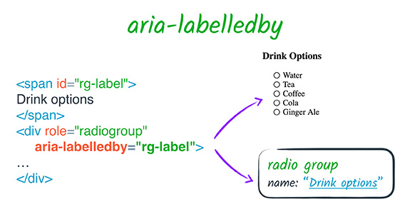
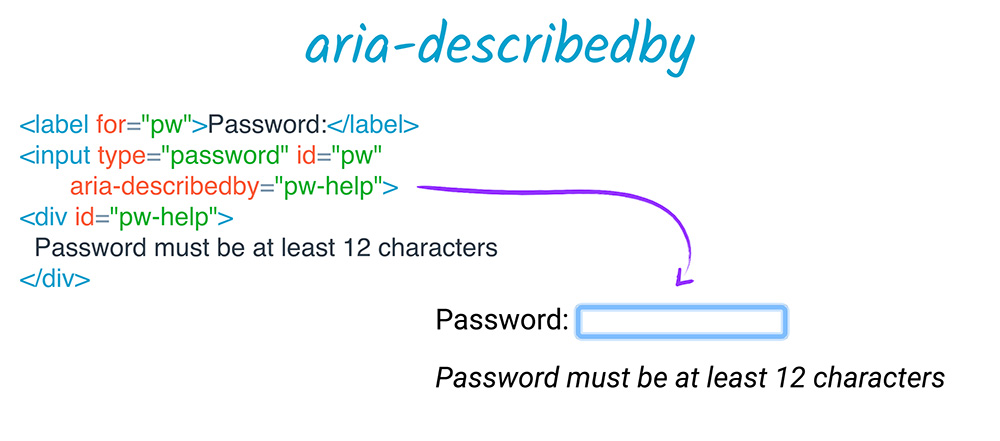
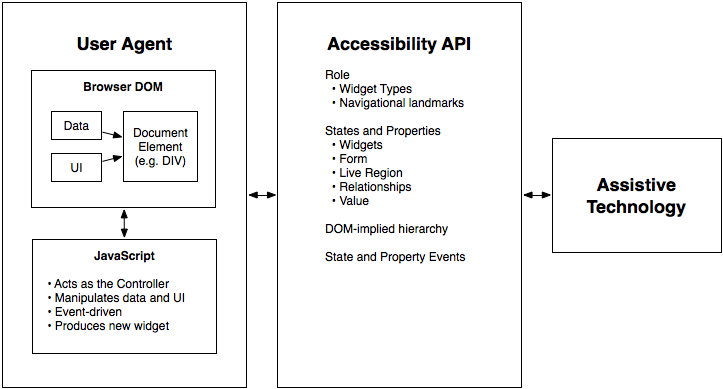

<!-- .slide: data-background="images/background.png" -->
## Getting Started with Web Accessibility</h2>
<br>
##### Whitney Kotlewski
##### Tao Zhang


## Agenda
- Introduction
- Designing accessible content
- Developing accessible content
- Screen reader basics
- Accessibility review reports


## Introduction
- About 15% of world population lives with some form of disability
- 1 billion people


## Disability
- **Short-term**: injury, jet lag, eye surgery ...
- **Long-term**: low vision, blind, deaf ...
- **Situational**: eye fatigue, body pain, low light, occupied hand, driving ...


## Forms of Disability


### Visual
<p>A broad range from <strong>no vision</strong> (total blindness) to <strong>limited or low vision</strong></p>


### Motor
<p>Users may prefer not to use a mouse, have <strong>RSI</strong> (Repetitive Strain Injury), or physical <strong>paralysis</strong> and <strong>limited range of motion</strong></p>


### Auditory
<p>Users may be <strong>completely deaf</strong> or <strong>hard of hearing</strong></p>


### Cognitive
<p style="text-align: left;">A broad range including:</p>
<ul>
<li>Learning disabilities</li>
<li>Reading disorders(**dyslexia**)</li>
<li>Attention deficit disorders(**ADHD** and **autism**)</li>
</ul>
<p style="text-align: left;">Far more users with cognitive disabilities than all the other types of disabilities combined.</p>


## Benefits of Accessibility
- Accessible interfaces is about good design and coding practice
- Good accessibility is good user experience
- Accessibility will enhance design, not destroy it


## Section 508
- The Rehabilitation Act of 1973
- Mandates that people with disabilities have **same access to and use** of ICT (Information and Communication Technology) comparable to those without disabilities


## Section 508
- Products procured by government agencies must pass Section 508 requirements
- Recent refresh incorporates WCAG 2.0 Level A and AA success criteria
  - Published: Jan. 18, 2017
  - Enforcement: Jan. 18, 2018


## WCAG 2.0
Web Content Accessibility Guidelines


### Overview of WCAG 2.0


### Level of Conformance
- Level  **A**: Sets a minimum level of accessibility and does not achieve broad accessibility for many situations.
- Level **AA**: Generally recommended for web-based information.
- Level **AAA**: W3C does not recommend be required as general policy because it is not possible to satisfy all Level AAA Success Criteria for some content.


## Designing accessible content
- Color contrast
- Keyboard access and focus
- Alternate text for images
- Headings and landmarks
- Labels and instructions


### Color contrast
[WCAG 1.4.3](https://www.w3.org/TR/UNDERSTANDING-WCAG20/visual-audio-contrast-contrast.html): Color contrast ratio is at least **4.5:1** for normal text and at least **3:1** for large text.
- Large text: at least 18 point or 14 point bold


### Color contrast
- Exceptions
  - Incidental: Text or images of text that are part of an inactive UI component or for pure decoration.
  - Logotypes: Text that is part of a logo or brand name.


### Color contrast
- Color contrast ratio check tools:
  - [WebAIM Color Contrast Checker](http://webaim.org/resources/contrastchecker)
  - [Contrast Ratio](http://leaverou.github.io/contrast-ratio/) by Lea Verou


### Keyboard access and focus
- **Focus**: Which control on the screen currently receives input from keyboard.
- **Focus ring**: visual focus indicator, style depending on browser and page style.  


### [Focusable elements](http://stackoverflow.com/questions/1599660/which-html-elements-can-receive-focus)
- Native interactive HTML elements are focusable:
  - `<input>`, `<button>`, `<a>`, `<select>` ...
- (Normally) not focusable:
  - `<p>`, `<div>`, `<span>`, `<h1>` ...


### Focusable elements
- Disabled elements can never be focusable
- Off-screen elements should not receive focus
- Only focus elements that keyboard users need to interact with


### Tab order matters
- **Tab order**: The order in which focus proceeds forward and backward through interactive elements via <kbd>Tab</kbd> key.


### Keyboard
- Interactive elements have expected interactions:
  - Link: click, tap, or <kbd>Enter</kbd> key
  - Button: click, tap, <kbd>Enter</kbd> key, or **<kbd>Space</kbd>** key
  - Input: click, tap, or <kbd>Enter</kbd> key


### Tab order matters
- [WCAG 1.3.2](https://www.w3.org/TR/UNDERSTANDING-WCAG20/content-structure-separation-sequence.html): Reading and navigation order, as determined by DOM structure, should be logical and intuitive.</p>
- Be careful changing visual position of elements on screen using CSS
- Avoid jumping around tab order


### Manage focus
- `tabindex="0"`: let natural DOM structure determine tab order
- `tabindex="-1"`: programmatically move focus (e.g., error message, menus, radio buttons, etc.)
- `tabindex="5"`: anti-pattern


### Focus management example
Customized menu
```html
<menu-list>
<!-- After the user presses the down arrow key,
focus the next available child -->
<menu-item tabindex="0">Map</menu-item>

<!-- call .focus() on this element -->
<menu-item tabindex="-1">Layer</menu-item>

<menu-item tabindex="-1">Scene</menu-item>
<menu-item tabindex="-1">Tool</menu-item>
<menu-item tabindex="-1">Data</menu-item>
</menu-list>
```
[Example code](http://codepen.io/jimmieego/pen/Obdebp)


### Keyboard traps
- Keyboard focus should not be locked or trapped at one particular element.
- **Temporary** keyboard trap is necessary for modal dialogs:
 - When modal is displayed: trap focus inside modal.
 - When modal is closed: restore focus to previously focused item.
 - [Demo](http://gdkraus.github.io/accessible-modal-dialog/) | [Example code](https://github.com/gdkraus/accessible-modal-dialog)


 ### Test focus
 - Tab through page to verify tab order doesn't disappear or jump out of logical sequence
 - Make sure to hide offscreen content
 - Rearrange elements' position in the DOM if necessary


 ### Which item has focus?
 ```javascript
$('body').on('focusin', function() {
    console.log(document.activeElement);
});
```
[Force Show Keyboard Focus Bookmarklet](http://pauljadam.com/bookmarklets/focus.html)


### Alternate text
- [WCAG 1.1.1](https://www.w3.org/TR/UNDERSTANDING-WCAG20/text-equiv-all.html): All non-text content that is presented to the user has a text alternative that serves the equivalent purpose


### Alternate text
- Images that convey meanings/functions should set `alt` attribute
  - Be accurate and equivalent in describing the image or its purpose
  - Keep it succinct
  - Words like "image of", "photo of" are not necessary


### Alternate text
- Decorative images should use `alt=""`
- If text/content surrounding the graphic provides meaning, use `alt=""`


### Alternate text for icon fonts
```html
<style>
  .icon-star:before { content: "★"; }
</style>

<span><span class="icon-star" aria-hidden="true"></span>Favorite</span>
```
[Accessible Icon Fonts](https://www.filamentgroup.com/lab/bulletproof_icon_fonts.html)


### Alternate text for SVGs
(If the SVG conveys meaning)
```html
<svg xmlns=http://www.w3.org/2000/svg role="img"
  aria-labelledby="title  desc">
    <title id="title">Circle</title>
    <desc id="desc">Large red circle with a black border</desc>
    <circle role="presentation" cy="60" r="55"
      stroke="black" stroke-width="2"
      fill="red"
    />
</svg>
```


### Alternate text for SVGs
(If the SVG is decorative)
```html
<p>
  <svg aria-hidden="true">
    <title>checkmark</title>
    <use xlink:href="#icon-checkmark"></use>
  </svg>
  Success! Your order went through.
</p>
```


### Alternate text for SVGs
(Linked Icon, no text or text is not meaningful)
```html
<a href="link" aria-label="Add this to wish list">
  <svg>
    <use xlink:href="#icon-addcircle"></use>
  </svg>
  Wish List
</a>
```


### Headings
- [WCAG 2.4.6](https://www.w3.org/TR/UNDERSTANDING-WCAG20/navigation-mechanisms-descriptive.html): Headings and labels describe topic or purpose.
  - Every page should have an `h1` heading
  - Headings must be properly nested
  - Headings are for structure, not formatting


### Landmark roles
- `banner`: The main header of a page; typically assigned to a header element.
- `contentinfo`: A collection of metadata, copyright information and the like.
- `main`: the main content of a document.
- `navigation`: A collection of links for navigation.  

[Demo](https://youtu.be/T5qE7L853MQ)


### Labels and instructions
[WCAG 3.3.2](https://www.w3.org/TR/UNDERSTANDING-WCAG20/minimize-error-cues.html): Labels or instructions are provided when content requires user input.


### Label
Calcite Web pattern
```html
<label>
	Email
	<input type="text" placeholder="name@example.com">
</label>
```


### `aria-label`
- Specifies a string as accessible label
- Overrides native labeling


### `aria-labelledby`
- Specifies `id`s of other DOM elements
- Overrides all other name sources
- Applicable to any element
- Can specify visually hidden elements



### `aria-describedby`
- Provides accessible description for an element
- References elements in the DOM separated from current element



## Developing accessible content
- Semantic HTML
- Accessible components and ARIA


### Semantic HTML


### Accessibility tree
Shows how website is interpreted by assistive technologies and how accessible data are provided.


Chrome Canary's accessibility tree view


Microsoft Edge's accessibility tree view


Assistive technologies simulate and relay user interactions like click and key press to accessibility tree.


[The contract model with accessibility APIs](https://www.w3.org/TR/wai-aria/introduction)



### Semantic HTML
- Most HTML elements have implicit semantics (**role** and **state**).
- Native HTML elements work predictably across browsers
 - Take advantage of this!


[Example](http://codepen.io/jimmieego/pen/yMePRB)
```html
<a href="http://www.esri.com">Esri Homepage</a>
```
- Role="link"
- Accessible name="Esri Homepage"
- State="focusable"


[Example](http://codepen.io/jimmieego/pen/yMePRB)
```html
<label><input type="checkbox" checked>Working at Esri</label>
```
- Role="checkbox"
- Accessible name="Working at Esri"
- State="focusable checked"


[Demo](https://youtu.be/pClOpS_g-iQ)


### Neutral semantics
- Some HTML elements do not convey semantics (role or state):
 - `<div>This is a block area</div>`
 - `<span>This is an inline area</span>`


### [WCAG 4.1.2: Name, Role, Value](https://www.w3.org/TR/UNDERSTANDING-WCAG20/ensure-compat-rsv.html)
<table>
 	<tr>
 		<td><b>Name</b></td>
 		<td>What do we call this thing?</td>
 	</tr>
 	<tr>
 		<td><b>State</b></td>
 		<td>What is this thing doing?</td>
 	</tr>
 	<tr>
 		<td><b>Role</b></td>
 		<td>What is its purpose?</td>
 	</tr>
 	<tr>
 		<td><b>Value</b></td>
 		<td>What value does it represent?</td>
 	</tr>
</table>


<p style="text-align: left;">If a neutral element is interactive, we need to do extra work:</p>  
- Make it **focusable**: `tabindex="0"`
- Receive **keyboard events**: <kbd>Enter</kbd>, <kbd>Space</kbd>
- **Name**: explicit label (`label`) or implicit text (`aria-label`, `aria-labelledby`)
- **Role**
- **States** and **properties**


### WAI-ARIA
#### Web Accessibility Initiative - Accessible Rich Internet Applications


### What is WAI-ARIA
- Specification for increasing accessibility of custom elements
- Allows developers to modify and augment accessibility tree from standard DOM


<p style="text-align: left;">ARIA doesn't augment any of the element's inherent behavior:</p>
<div align="left">
	<ul>
		<li>Focusable</li>
		<li>Keyboard event listeners</li>
	</ul>
</div>
<p style="text-align: left;">Custom behaviors still need to be implemented</p>  


### ARIA attributes

| Type | Purpose | Examples |
|------|---------|----------|
| **Roles** | Meaning of an element | `tooltip`, `tablist`, `search` |
| **Properties** | Relationships and functions | `aria-required`, `aria-controls`, `aria-label`, `aria-labelledby` |
| **States** | Current interaction states | `aria-checked`, `aria-expanded`, `aria-hidden` |


### [An ARIA example](http://codepen.io/jimmieego/pen/dvGJbJ)
```html
<li tabindex="0" class="checkbox" checked>
	Show premium content
</li>
```
- Sighted users see a checkbox as a result of CSS `class="checkbox"`.
- Screen reader users will not know this is meant to be a checkbox.


### [An ARIA example](http://codepen.io/jimmieego/pen/dvGJbJ)
```html
<li tabindex="0" class="checkbox" role="checkbox" checked
aria-checked="true">
	Show premium content
</li>
```
Screen reader will report this as a checkbox.


[Demo](https://youtu.be/oOEwGb6k97I)


### ARIA best practices
<p style="text-align:left;">1. Do not change native semantics, unless you *really* have to.</p>
 - Example: A developer wants to implement a heading which is also a button.
 - Don't do this:
```html
<h2 role="button">heading button</h2>
```
 - Do this:
```html
<h2><button>heading button</button></h2>
```


<p style="text-align:left;">2. All interactive ARIA elements must be usable with keyboard.</p>


- The elements should respond to standard key strokes.
 - Example: If using `role="button"`, add `tabindex="0"` and support <kbd>Enter</kbd> and <kbd>Space</kbd> actions.


- The user must be able to navigate and perform actions using keyboard.
 - Example: If allowing clicking through data grid, support navigating grid cells using keyboard.


 <p style="text-align:left;">3. Do not use `role="presentation"` or `aria-hidden="true"` on a visible and focusable element.</p>
 <div align="left">
 <ul>
 <li>This will result in focusing on "nothing".</li>
 <li>Don't do these:</li>
 </ul>
 </div>

 ```html
 <button role="presentation">Press me</button>
 <button aria-hidden="true">Press me</button>
 ```


 <p style="text-align:left;">4. All interactive elements must have an accessible label or name.</p>
<p style="text-align:left;">Do this:</p>
```html
<label>
	Email
	<input type="text" placeholder="name@example.com">
</label>
```


### Create accessible web components


<h4><a href="https://www.w3.org/TR/wai-aria-practices-1.1/">ARIA Design Patterns</a></h4>


## Screen reader basics
- [Demo](https://youtu.be/fCPr12a6tPQ)
- [a11ycasts](https://youtu.be/5R-6WvAihms)
  - Mac: [VoiceOver](https://youtu.be/5R-6WvAihms)
  - Windows: [NVDA](https://youtu.be/Jao3s_CwdRU)


## Accessibility review reports


## Resources
- Documentation
  - [W3C-WCAG 2.0](https://www.w3.org/TR/WCAG20/)
  - [Interpretation of WCAG 2.0 success criteria](https://www.wuhcag.com/wcag-checklist/)
  - [WAI-ARIA Authoring Practices 1.1](https://www.w3.org/TR/wai-aria-practices-1.1/)
- Courses
  - egghead.io: [Start Building Accessible Web Applications Today](https://egghead.io/courses/start-building-accessible-web-applications-today)
  - Udacity: [Web Accessibility by Google](https://www.udacity.com/course/web-accessibility--ud891)
- Browser extensions
  - [aXe Chrome extension](http://www.deque.com/products/axe/)
  - [Chrome Accessibility Developer Tools](https://chrome.google.com/webstore/detail/accessibility-developer-t/fpkknkljclfencbdbgkenhalefipecmb?hl=en)


<section data-background-image="images/lastslide.png">
</section>
